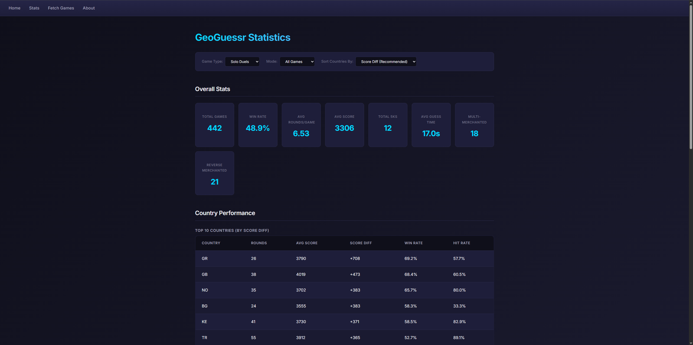
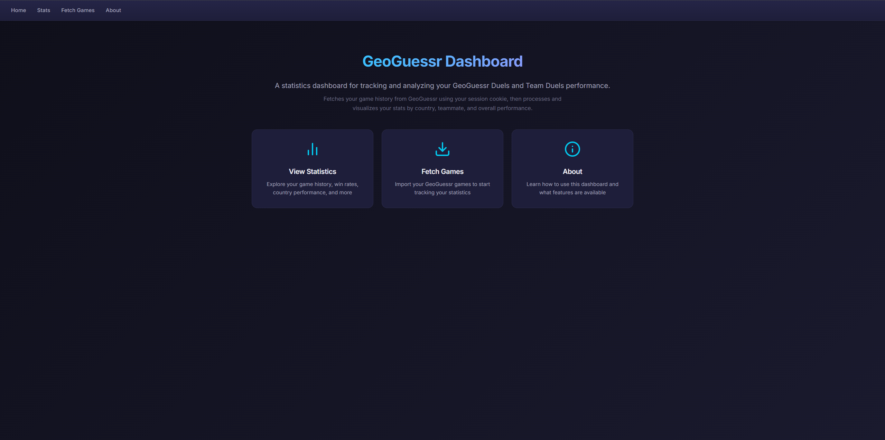
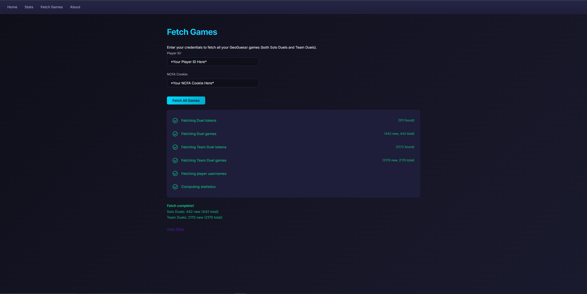
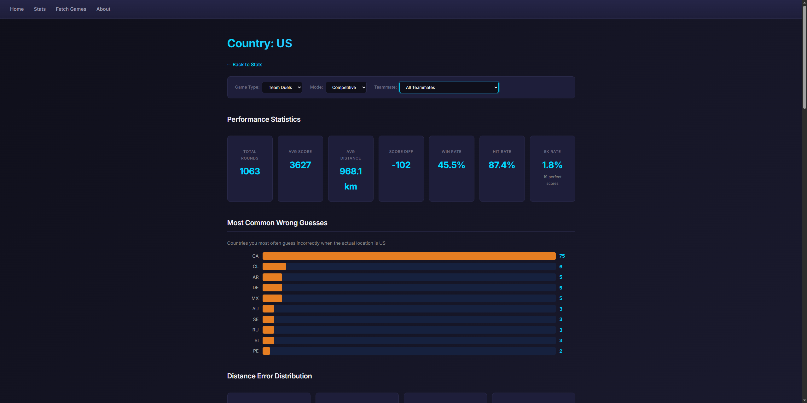
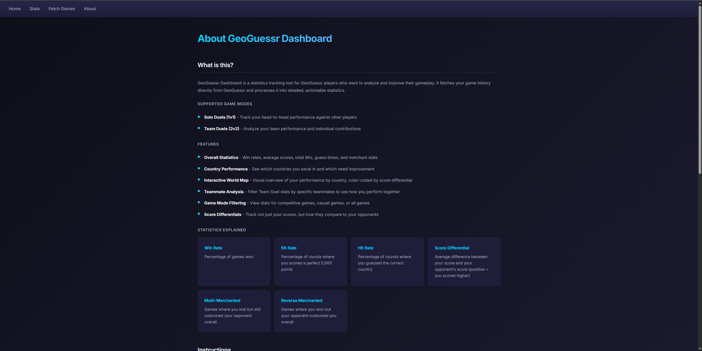

# GeoGuessr Statistics Dashboard

[](https://github.com/keshavt3/geoguessr-dashboard/actions/workflows/ci.yml)

A statistics dashboard for GeoGuessr players to analyze their Duels and Team Duels performance. Fetches your game history directly from the GeoGuessr API and presents detailed analytics by country, teammate, and game mode.



## Features

- **Comprehensive Statistics** - Win rates, average scores, 5K rates, guess times, and score differentials
- **Country-Level Analytics** - Performance breakdown for every country with hit rates and common wrong guesses
- **Interactive World Map** - Color-coded visualization of your performance by country
- **Teammate Analysis** - Filter stats by teammate to see how you perform with different partners
- **Game Mode Filtering** - Separate stats for competitive and casual games
- **Both Game Modes** - Supports Team Duels (2v2) and solo Duels (1v1)

## Screenshots

<details>
<summary>View all screenshots</summary>

### Home Page


### Fetch Games


### Overall Statistics


### World Map Visualization


### Country Detail (United States)


### About Page


</details>

## Built With

- **Backend**: Python, Flask, SQLite
- **Frontend**: HTML, CSS, JavaScript
- **Data**: GeoGuessr API, reverse_geocoder for coordinate lookups
- **Testing**: pytest

## Getting Started

### Prerequisites

- Python 3.10+
- GeoGuessr account with `_ncfa` authentication cookie

### Installation

```bash
# Clone the repository
git clone https://github.com/keshavt3/geoguessr-dashboard.git
cd geoguessr-dashboard

# Create and activate virtual environment
python -m venv myenv
source myenv/bin/activate

# Install dependencies
pip install -e ".[dev]"

# Initialize the database
bin/geodashdb create

# Start the server
bin/geodashrun
```

Then open http://localhost:8000 in your browser.

### Getting Your Authentication Cookie

1. Log into [GeoGuessr](https://www.geoguessr.com) in your browser
2. Open Developer Tools (F12) → Application → Cookies
3. Copy the value of the `_ncfa` cookie
4. Paste it into the Fetch Games page

## Project Structure

```
geoguessr-dashboard/
├── geoguessr/           # Data pipeline
│   ├── fetch_games.py   # API fetching with pagination and error handling
│   ├── process_stats.py # Statistics aggregation
│   └── utils.py         # Shared utilities
├── geodash/             # Flask web application
│   ├── api/             # REST API endpoints
│   ├── views/           # Page routes
│   └── model.py         # Database layer
├── tests/               # pytest test suite
├── docs/                # Screenshots
└── .github/workflows/   # CI pipeline
```

## Running Tests

```bash
pytest           # Run all tests
pytest -v        # Verbose output
```

## Statistics Explained

| Stat | Description |
|------|-------------|
| **Win Rate** | Percentage of games won |
| **5K Rate** | Percentage of rounds with a perfect 5000 score |
| **Hit Rate** | Percentage of rounds where you guessed the correct country |
| **Score Diff** | Average difference between your score and opponent's score |
| **Multi-Merchant** | Games where you lost but outscored your opponent |
| **Reverse Merchant** | Games where you won but were outscored |

## License

MIT
